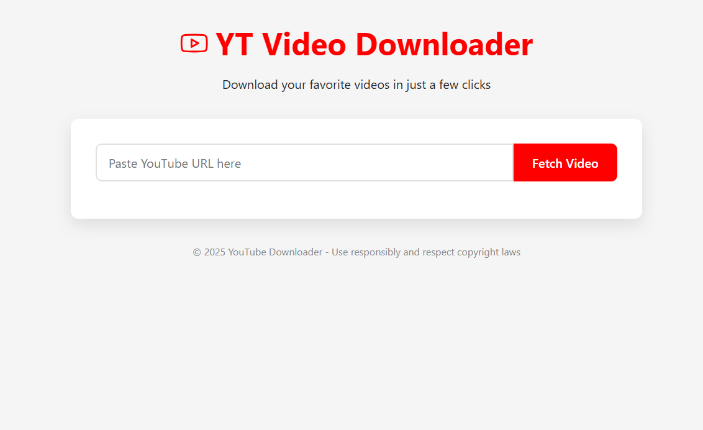
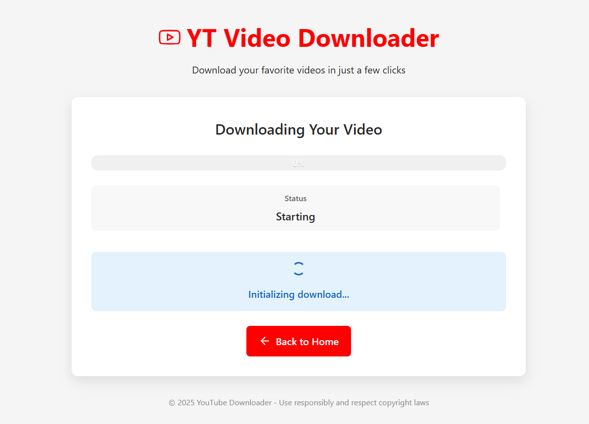

# DownTube

A simple and user-friendly web application that allows users to download YouTube videos in various quality formats.

## Screenshots

### Main Page



### Download Progress Page



## Features

- 📹 Download YouTube videos in multiple quality options (360p to 4K)
- 🎵 Extract audio-only in M4A format
- 📊 Real-time download progress tracking
- 🎨 Clean, responsive user interface
- 🔄 Format conversion with FFmpeg
- 📁 Files saved directly to user's Downloads folder

## Requirements

- Python 3.6+
- Flask
- yt-dlp
- FFmpeg (for post-processing and format conversion)

## Installation

1. Clone the repository:

```bash
git clone https://github.com/yourusername/youtube-downloader.git
cd youtube-downloader
```

2. Create and activate a virtual environment (optional but recommended):

```bash
python -m venv venv
# On Windows
venv\Scripts\activate
# On macOS/Linux
source venv/bin/activate
```

3. Install the required packages:

```bash
pip install -r requirements.txt
```

4. Install FFmpeg:
   - **Windows**: Download from [ffmpeg.org](https://ffmpeg.org/download.html) and add to PATH
   - **macOS**: `brew install ffmpeg`
   - **Linux**: `sudo apt install ffmpeg` or equivalent for your distribution

## Usage

1. Start the application:

```bash
python app.py
```

2. Open your web browser and navigate to:

```
http://127.0.0.1:5000
```

3. Paste a YouTube URL in the input field and click "Fetch Video"

4. Select your desired video quality from the dropdown menu

5. Click "Download Now" to start the download

6. Track download progress on the progress page

7. Once complete, click "Download File" to save the file to your computer

## How It Works

1. The application uses yt-dlp to fetch video information and available formats
2. Users select their preferred quality option
3. The video is downloaded and processed in the background
4. Progress is tracked in real-time and displayed to the user
5. Files are saved to the user's Downloads folder by default

## Customization

You can modify the download directory by editing the `DOWNLOAD_DIR` variable in `app.py`:

```python
# Use a custom download directory
DOWNLOAD_DIR = "/path/to/your/preferred/directory"
```

## Legal Disclaimer

This tool is intended for downloading videos for personal use only. Please respect copyright laws and the YouTube Terms of Service. Do not download or distribute copyrighted content without permission.

## License

MIT License

## Contributing

Contributions are welcome! Please feel free to submit a Pull Request.

## Acknowledgements

- [yt-dlp](https://github.com/yt-dlp/yt-dlp) for the powerful YouTube download functionality
- [Flask](https://flask.palletsprojects.com/) for the web framework
- [FFmpeg](https://ffmpeg.org/) for media processing capabilities
